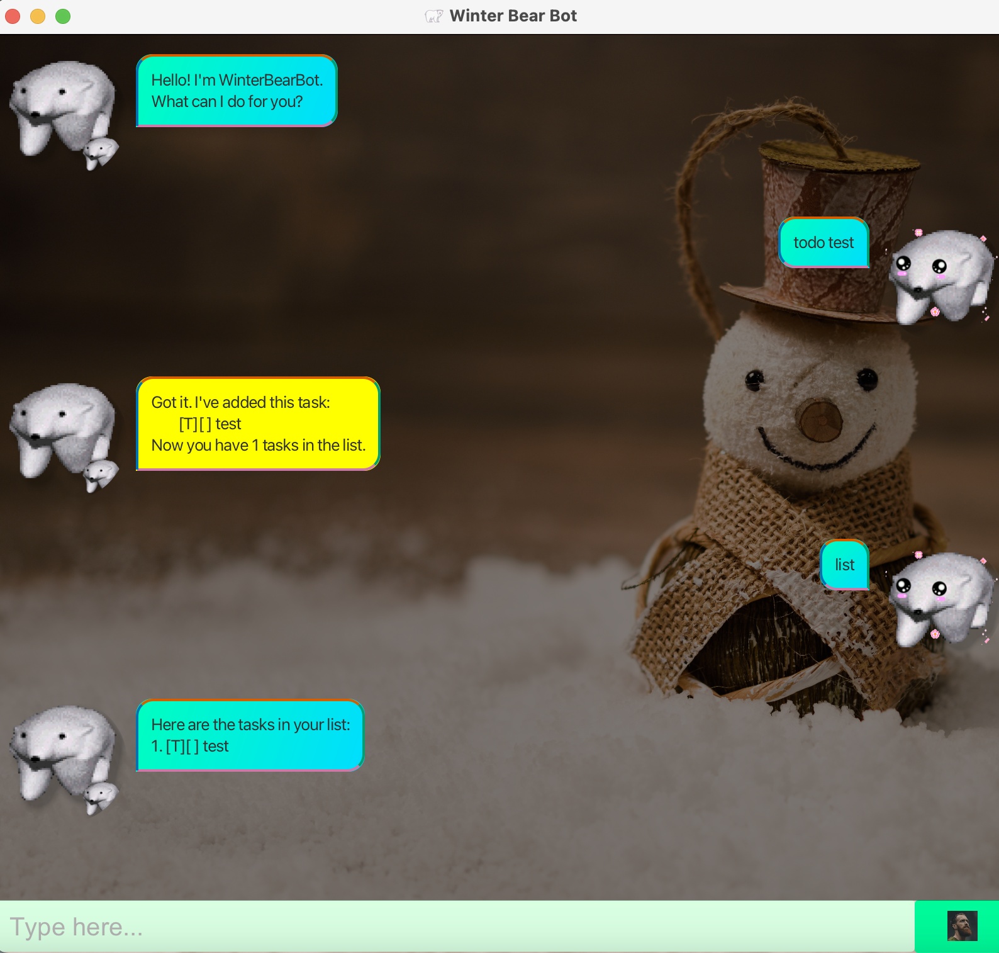

# WinterBearBot User Guide 🐻❄️
> “Winter is the time for comfort, for good food and warmth, for the touch of a friendly hand and for a talk beside the fire.” – Edith Sitwell [(source)](https://www.goodreads.com/quotes/124075-winter-is-the-time-for-comfort-for-good-food-and)



WinterBearBot is your cozy assistant for managing tasks, deadlines, and events. It's designed to be:
* User-friendly
* 🧊 Cool to use
* ⏱️ Efficient

Getting started is simple:
1. Clone the repository from [here](https://github.com/WhiteBear82/ip/releases).
2. Run the program and start adding your tasks.
3. Manage your tasks like a pro! 😎

And it’s **completely free!** 🎉

Features:

- [X] Add tasks, deadlines, or events effortlessly.
- [X] Manage your to-do list with actions like marking as done, unmarking, deleting
- [X] List all tasks in a clean, organized manner.
- [ ] 

```java
public class WinterBearBot {
    public static void main(String[] args) {
        new WinterBearBot().runProgram();
    }
}
```

## Displaying help

Shows a list of available commands and their usage.

**Example Usage:** 

```
help
```

**Expected Output:** 

```
Available Commands:
- list: Lists all tasks.
- mark [task number]: Marks a task as completed.
- unmark [task number]: Unmarks a completed task.
...
```

## Adding todos

Adds a simple task without a deadline or time constraint.

**Example Usage:** 

```
todo [task description]
```

**Expected Output:** 

```
Got it. I've added this task:
[T][ ] Borrow book
Now you have 3 tasks in the list.
```

## Adding deadlines

Adds a task with a specific deadline.

**Example Usage:** 

```
deadline [description] /by [date]
```

**Expected Output:** 

```
Got it. I've added this task:
[D][ ] Return book (by: Sunday)
Now you have 4 tasks in the list.
```

## Adding events

Adds a task that has a start and end time.

**Example Usage:** 

```
event [description] /from [start time] /to [end time]
```

**Expected Output:** 

```
Got it. I've added this task:
[E][ ] Project meeting (from: Mon 2pm to: 4pm)
Now you have 5 tasks in the list.
```

## Marking a task as completed

Mark a specific task as completed in the task list.

**Example Usage:** 

```
mark [task number]
```

**Expected Output:** 

```
Nice! I've marked this task as done:
[T][X] Borrow book
```

## Unmarking a task as completed

Unmark a previously completed task, changing it back to incomplete.

**Example Usage:** 

```
unmark [task number]
```

**Expected Output:** 

```
OK, I've marked this task as not done yet:
[T][X] Borrow book
```

## Listing all tasks

Displays all tasks currently stored in the task list.

**Example Usage:** 

```
list
```

**Expected Output:** 

```
Here are the tasks in your list:
1. [T][ ] Read book
2. [D][X] Return book (by: Sunday)
3. [E][ ] Project meeting (from: Mon 2pm to: 4pm)
```

## Filtering tasks that are due today

Displays tasks that are due today.

**Example Usage:** 

```
tasks
```

**Expected Output:** 

```
Tasks due today:
[D][ ] Return book (by: 9th of February 2025, 5:00PM)
```

## Deleting a task

Removes a task from the list.

**Example Usage:** 

```
delete [task number]
```

**Expected Output:** 

```
Noted. I've removed this task:
[E][ ] Project meeting (from: Mon 2pm to: 4pm)
Now you have 4 tasks in the list.
```

## Exiting the application

Closes the program.

**Example Usage:** 

```
bye
```

**Expected Output:** 

```
Exits the program.
```
